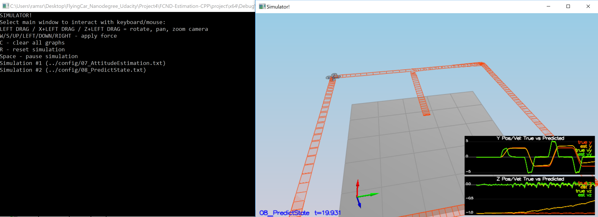
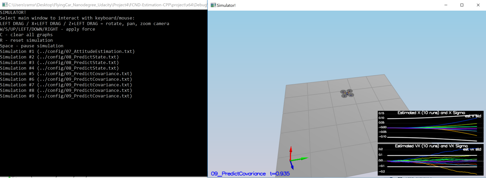
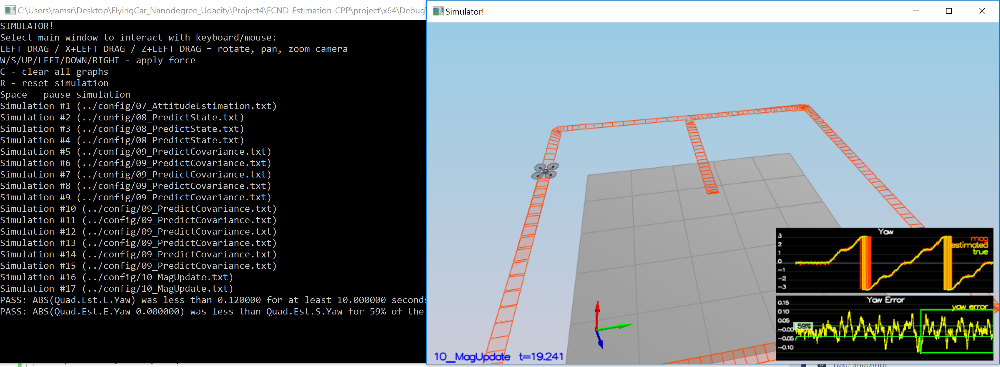
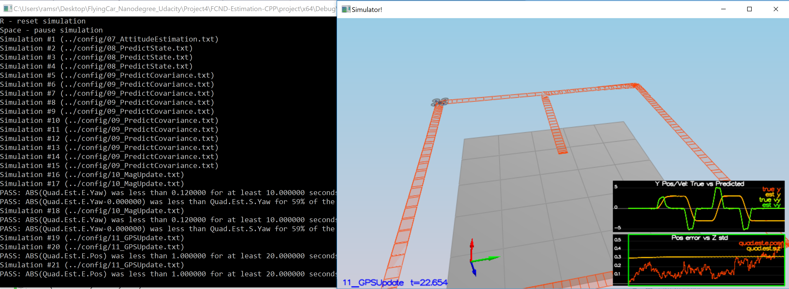

#### Provide a Writeup that includes all the rubric points and how you addressed each one. You can submit your writeup as markdown or pdf

This is the writeup for the project.

#### Determine the standard deviation of the measurement noise of both GPS X data and Accelerometer X data

Calculated standard deviation by using pandas std() function after reading the files using read_csv() function.

The measured values were :
```
MeasuredStdDev_GPSPosXY = 0.7091
MeasuredStdDev_AccelXY = 0.4881
```


#### Implement a better rate gyro attitude integration scheme in the UpdateFromIMU() function

The gyro attitude filter was implemented by converting to quaternion from Euler Roll/PitchYaw and integrating using the quaternion in the inertia frame.

```c++
  Quaternion<float> altitude = Quaternion<float>::FromEuler123_RPY(rollEst, pitchEst, ekfState(6));
  altitude.IntegrateBodyRate(gyro, dtIMU);

  float predictedPitch = altitude.Pitch();
  float predictedRoll = altitude.Roll();
  ekfState(6) = altitude.Yaw();	// yaw
  // normalize yaw to -pi .. pi
  if (ekfState(6) > F_PI) ekfState(6) -= 2.f*F_PI;
  if (ekfState(6) < -F_PI) ekfState(6) += 2.f*F_PI;
```

Results:


#### Implement all of the elements of the prediction step for the estimator

All the  functions `PredictState()` , `GetRbgPrime()` and `Predict()` are implemented in `QuadEstimatorEKF.cpp` file.
The acceleration is accounted for as a command in the calculation of gPrime. 
The covariance update follows the classic EKF update equation.

```c++
VectorXf QuadEstimatorEKF::PredictState(VectorXf curState, float dt, V3F accel, V3F gyro)
{
  assert(curState.size() == QUAD_EKF_NUM_STATES);
  VectorXf predictedState = curState;
  Quaternion<float> attitude = Quaternion<float>::FromEuler123_RPY(rollEst, pitchEst, curState(6));

  ////////////////////////////// BEGIN STUDENT CODE ///////////////////////////
  V3F acceleration = attitude.Rotate_BtoI(accel);
  predictedState(0) = curState(0) + dt * curState(3);
  predictedState(1) = curState(1) + dt * curState(4);
  predictedState(2) = curState(2) + dt * curState(5);
  predictedState(3) = curState(3) + dt * acceleration.x;
  predictedState(4) = curState(4) + dt * acceleration.y;
  predictedState(5) = curState(5) + dt * (acceleration.z - CONST_GRAVITY);
  /////////////////////////////// END STUDENT CODE ////////////////////////////
  return predictedState;
}

MatrixXf QuadEstimatorEKF::GetRbgPrime(float roll, float pitch, float yaw)
{
  // first, figure out the Rbg_prime
  MatrixXf RbgPrime(3, 3);
  RbgPrime.setZero();
  ////////////////////////////// BEGIN STUDENT CODE ///////////////////////////
  RbgPrime << -cos(pitch) * sin(yaw), -sin(roll)*sin(pitch)*sin(yaw) - cos(pitch)*cos(yaw), -cos(roll)*sin(pitch)*sin(yaw) + sin(roll)*cos(yaw),
	  cos(pitch)*cos(yaw), sin(roll)*sin(pitch)*cos(yaw) - cos(roll)*sin(yaw), cos(roll)*sin(pitch)*cos(yaw) + sin(roll)*sin(yaw),
	  0, 0, 0;
  /////////////////////////////// END STUDENT CODE ////////////////////////////
  return RbgPrime;
}

void QuadEstimatorEKF::Predict(float dt, V3F accel, V3F gyro)
{
  // predict the state forward
  VectorXf newState = PredictState(ekfState, dt, accel, gyro);
  // we'll want the partial derivative of the Rbg matrix
  MatrixXf RbgPrime = GetRbgPrime(rollEst, pitchEst, ekfState(6));

  // we've created an empty Jacobian for you, currently simply set to identity
  MatrixXf gPrime(QUAD_EKF_NUM_STATES, QUAD_EKF_NUM_STATES);
  gPrime.setIdentity();

  ////////////////////////////// BEGIN STUDENT CODE ///////////////////////////
  gPrime(0, 3) = gPrime(1, 4) = gPrime(2, 5) = dt;
  gPrime(3, 6) = (RbgPrime(0) * accel).sum() * dt;
  gPrime(4, 6) = (RbgPrime(1) * accel).sum() * dt;
  gPrime(5, 6) = (RbgPrime(2) * accel).sum() * dt;
  ekfCov = gPrime * ekfCov * gPrime.transpose() + Q;
  /////////////////////////////// END STUDENT CODE ////////////////////////////
  ekfState = newState;
}
```

#### Implement the magnetometer update

The function `UpdateFromMag()` is implemented in the file `QuadEstimatorEKF.cpp`

```c++
void QuadEstimatorEKF::UpdateFromMag(float magYaw)
{
  VectorXf z(1), zFromX(1);
  z(0) = magYaw;
  MatrixXf hPrime(1, QUAD_EKF_NUM_STATES);
  hPrime.setZero();
  ////////////////////////////// BEGIN STUDENT CODE ///////////////////////////
  hPrime(6) = 1;
  zFromX(0) = ekfState(6);
  if (magYaw - ekfState(6) > F_PI) { zFromX(0) += 2.f*F_PI; }
  else if (magYaw - ekfState(6) < -F_PI) { zFromX(0) -= 2.f*F_PI;}
  /////////////////////////////// END STUDENT CODE ////////////////////////////
  Update(z, hPrime, R_Mag, zFromX);
}
```

#### Implement the GPS update

The function `UpdateFromGPS()` is implemented in the file `QuadEstimatorEKF.cpp`.

```c++
void QuadEstimatorEKF::UpdateFromGPS(V3F pos, V3F vel)
{
  VectorXf z(6), zFromX(6);
  z(0) = pos.x;
  z(1) = pos.y;
  z(2) = pos.z;
  z(3) = vel.x;
  z(4) = vel.y;
  z(5) = vel.z;

  MatrixXf hPrime(6, QUAD_EKF_NUM_STATES);
  hPrime.setZero();
  ////////////////////////////// BEGIN STUDENT CODE ///////////////////////////
  hPrime.setIdentity();
  for (int i = 0; i < 6; i++)
  {
	  zFromX(i) = ekfState(i);
  }
  /////////////////////////////// END STUDENT CODE ////////////////////////////
  Update(z, hPrime, R_GPS, zFromX);
}
```

#### Meet the performance criteria of each step









#### De-tune your controller to successfully fly the final desired box trajectory with your estimator and realistic sensors

Yes the controller is detuned to succesfully fly the final desired box trajectory.
